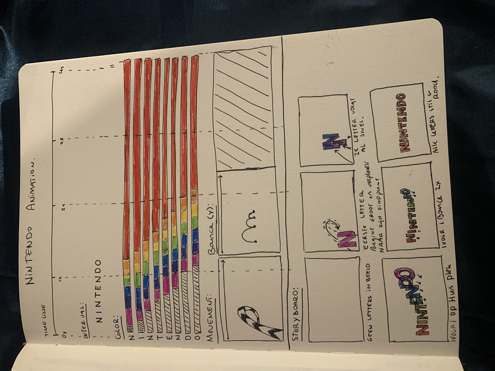
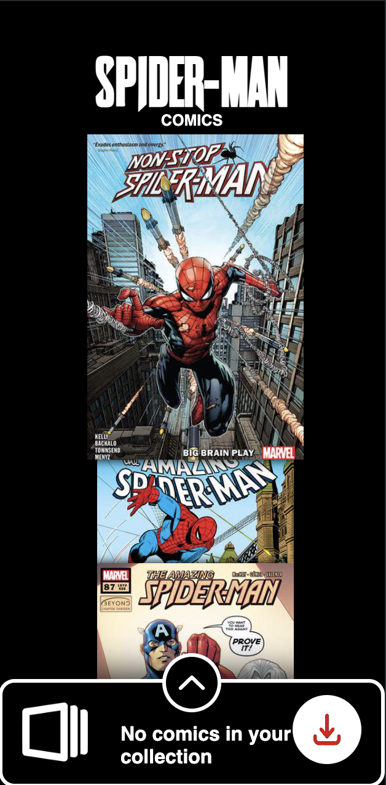
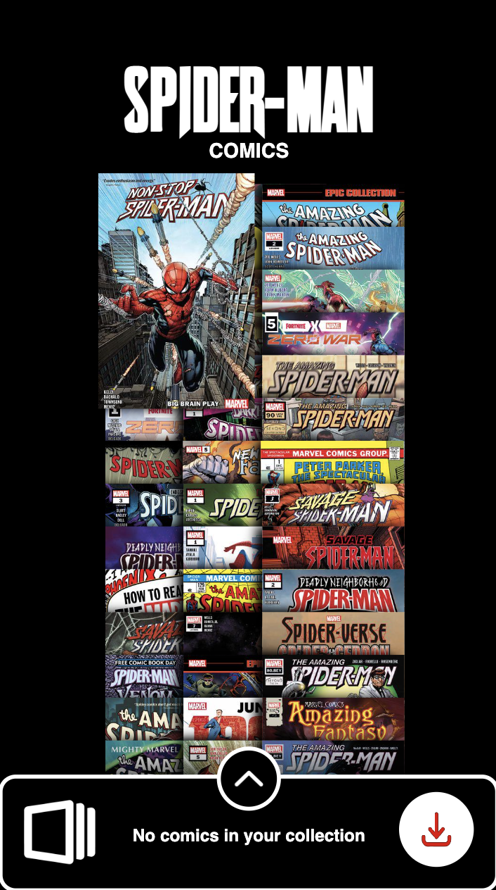
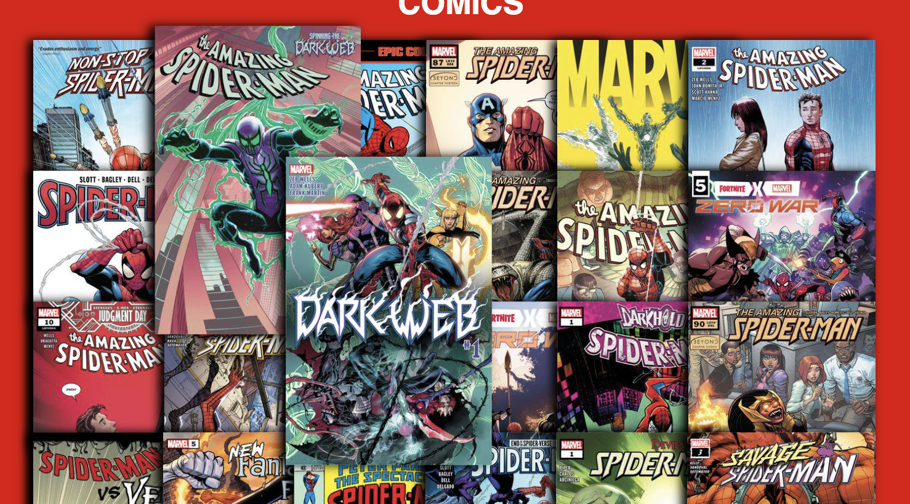
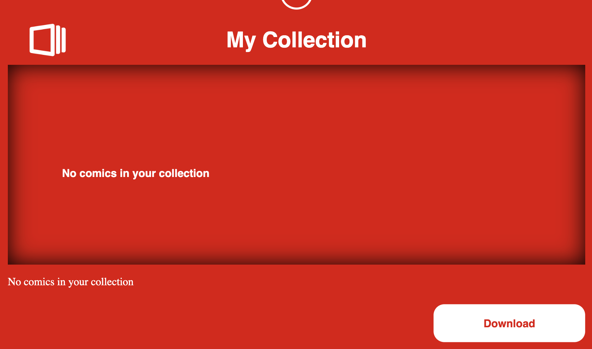
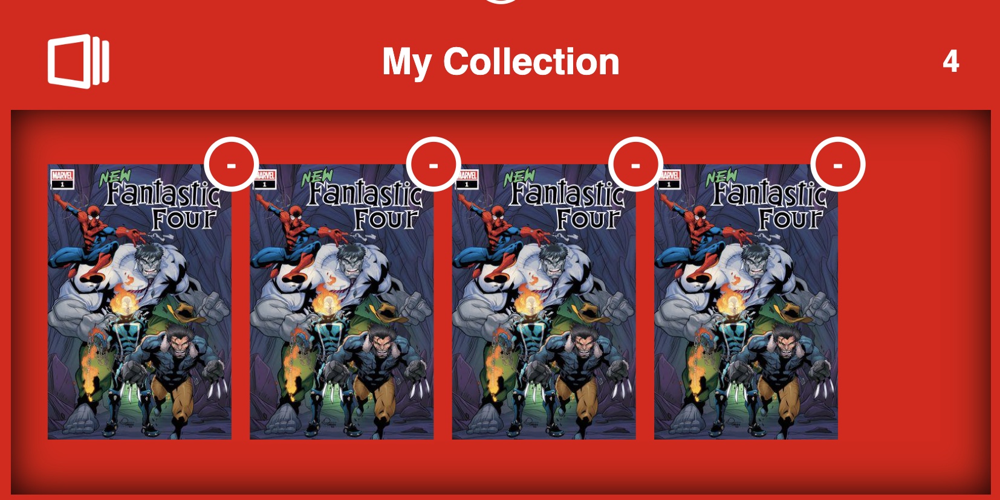
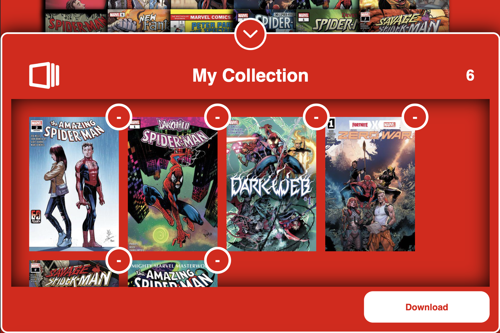
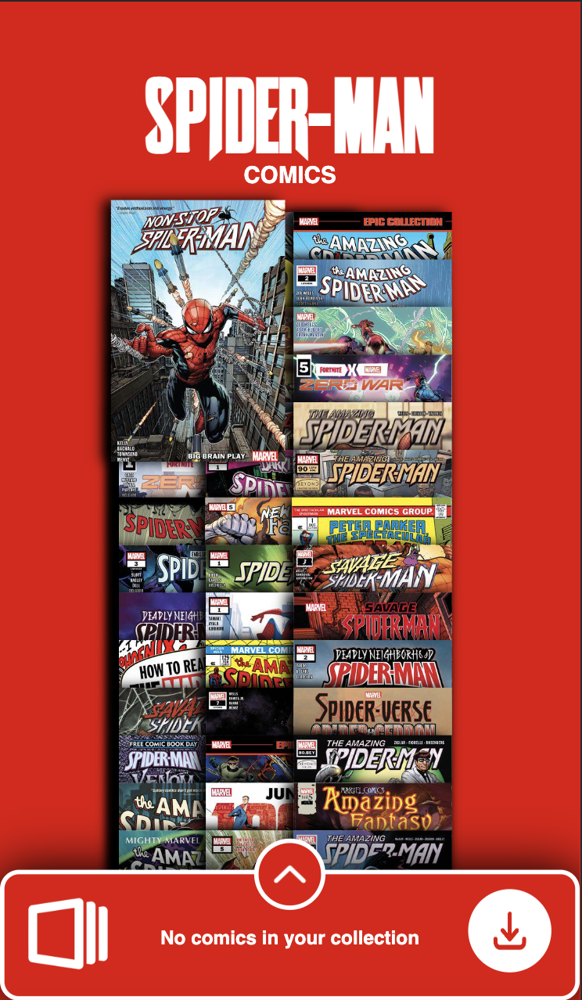
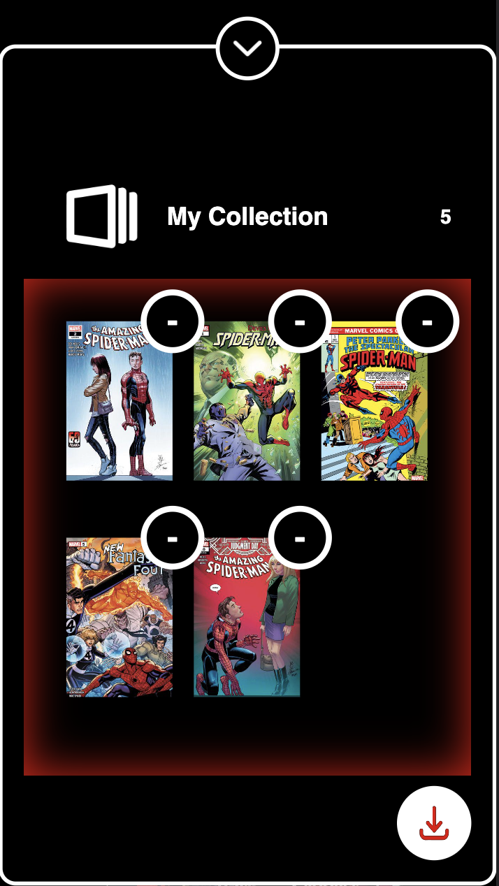
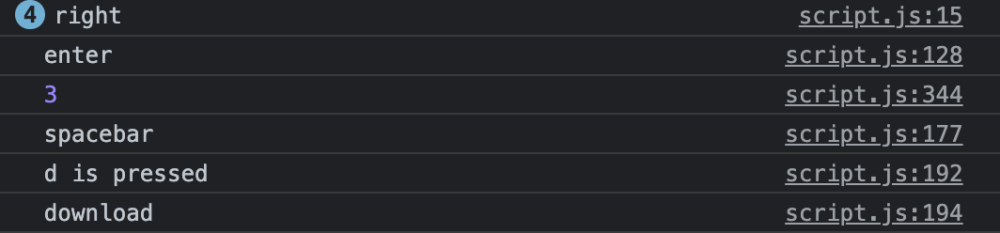

# Procesverslag
**Auteur:** Niels Aling

**De opdrachten:** [opdracht 1](opdracht1/index.html) en [opdracht 2](opdracht2/index.html)

## Bronnenlijst
  1. https://www.youtube.com/watch?v=AyP1Nj9zU3k
  2. https://matthewlein.com/tools/ceaser
  3. https://codepen.io/shooft/pen/PodNyKx
  4. https://hslpicker.com/#10f
  5. https://www.fontsquirrel.com/tools/webfont-generator
  6. https://bennettfeely.com/clippy/

## Opdracht 1 plan

  
uitwerken na schetsen idee (voor week 2)

  ### Je storyboard:
  

  ### Je ambitie: 
  Aan deze technieken/punten wil ik werken:
  - HSL kleuren 
  - positioning
  - :before en/of :after
  - border animation met mask
 

## Opdracht 1 reflectie

  
uitwerken bij afronden opdracht (voor week 4)

  ### Je uitkomst - karakteristiek screenshot(s):
  #### Light Mode 
  
  
  

  #### Dark Mode
  
  
  

  ### Dit ging goed/Heb ik geleerd: 
  De color animation ging heel gemakkelijk. Daarnaast het werken met before en after was redelijk nieuw voor me maar ging me best wel goed af!

  

  ### Dit was lastig/Is niet gelukt:
  In eerste instantie wilde ik de border animeren met een clipmask. Dat is wel gelukt maar was super lastig. Sanne heeft me daarna geholpen met een conic-gradient mask. Die werkte veel netter.

  

  Ook probeerde ik een toggle button te maken voor de dark/light mode, maar ik kreeg in javascript het :before element niet te pakken. Dat is me dus helaas (nog) niet gelukt.
  
  

## Opdracht 2 plan

  
uitwerken na schetsen idee (voor week 5)

  ### Je ontwerp:
  

  ### Je ambitie: 
  Aan deze technieken/punten wil ik werken:
  - EventListeners anders dan klikken 
  - Drag and Drop
  - functies schrijven in Javascript

## Opdracht 2 test

  
uitwerken na testen (week 7)

  Neem minimaal 5 bevindingen op:

  ### Bevinding 1:
  Nog even goed kijken naar responsiveness
   

  #### oplossing:
  @media gebruikt om breekpunten strakker te maken
   

  <pre><code>
    @media screen and (max-width: 700px) { 
    #mobile{
      display: flex;
    }

    #download{
      display: none;
    }

    #collection.show{
      height: 95vh;
      padding-top: 5em;
      padding-bottom: 5em;
    }

    #collection.show li img{
      width: 5em;
    }
  }

  @media screen and (max-width: 500px) { 
    #comics li
    {
      height: 10em;
    }

    #collection p:nth-of-type(2)
    {
      font-size: 0.8em;
        left: 50%;
        transform: translateX(-50%);
        margin-top: 1.5em;
    }
  }
  </code></pre>

  ### Bevinding 2:
  Mobiele download knop werkt nog niet 

   

  #### oplossing:
  De download functie ook op de mobiele button zetten

  <pre><code>
    const mobile = document.querySelector('#mobile')

    mobile.addEventListener('click', () => 
    {
      console.log("download")
      const covers = document.querySelectorAll('#collection ul li img')

      //download comics
      covers.forEach(cover => 
      {
        console.log(cover.src)

        //create link
        const link = document.createElement('a')
        link.href = cover.src
        link.download = cover.src
        link.click()
      })

      //give 3 seconds feedback to user comics are downloaded
      // remove comics from basket
      mobile.innerHTML = '...'
      setTimeout(() => 
      { 
        //remove inner html from button
        mobile.innerHTML = ''

        // put image back in button
        const mobileImage = document.createElement('img')
        mobileImage.src = 'images/download.png'
        mobile.appendChild(mobileImage)

        //remove comics from basket
        covers.forEach(cover =>
        {
          collectionList.removeChild(cover.parentElement)
        }) 

        //count amount of comics in basket
        amountComics ()
    }, 3000)
  })
  </code></pre>

  ### Bevinding 3:
  Het klopt niet helemaal welke comics de current is. Hij past het namelijk niet aan wanneer er geklikt wordt. Het blijft alleen de current van de toetsen. Er kunnen dus 2 selected comics zijn.

   

  #### oplossing:
  De oplossing hier voor is nog niet gevonden. Ik zal iets in mijn functie moeten toevoegen dat de class .current wordt toegepast op de comic waar op geklikt wordt en wordt verwijderd bij de vorige geselecteerde comic. 

  ### Bevinding 4:
  Wanneer je op downloaden klikt zonder dat er iets in je lijstje staat gaat hij laden en dan staat er dubbel 
  "no comics in your collection"

   

  #### oplossing:
  Een if else statement in de download functie,
  wanneer er niks in de collection zit doet de download knop niks.

  <pre><code>
    // als er geen comics in de basket zitten geef een alert en stop de functie
    if (collectionList.childElementCount === 0)
    {
    alert('There are no comics in your basket')
    return
    }
    else
    {
    console.log("download")
    }
  </code></pre>

  ### Bevinding 5:
  Je kan veel van dezelfde comics in je collection zetten 
   

  #### oplossing:
  Ik weet hier de oplossing niet voor
  

## Opdracht 2 reflectie

  
uitwerken bij afronden opdracht (voor week 8)

  ### Je uitkomst - karakteristiek screenshot(s):
   
   
  

  ### Dit ging goed/Heb ik geleerd: 
  Het verbaasde me hoeveel functies ik beb kunnen schrijven. 
  Zo heb ik functies voor het verplaatsen van comics, verwijderen uit een lijst en downloaden, maar ook 
  functies voor het tellen van children en het gebruiken van specifieke toetsen. 

  

  ### Dit was lastig/Is niet gelukt:
  Het is me niet meer gelukt om een drag en drop systeem te maken. Dit werkte eerst wel, maar door de functies die dingen tellen kwam het in de knoop met mijn onder anderen mijn empty state. Ik het er daarom vor gekozen om dit weg te laten. 

  <pre><code>
    // sortable list collection 
    new Sortable(comicsList, 
    {
      group: {
      name: 'shared',
      pull: 'clone',
      put: false // Do not allow items to be put into this list
      },
      animation: 150,
      sort: false // To disable sorting: set sort to false
    })

    new Sortable(collectionList, 
    {
      group: 'shared',
      animation: 150
    })
  </code></pre>

