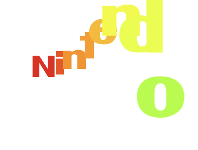
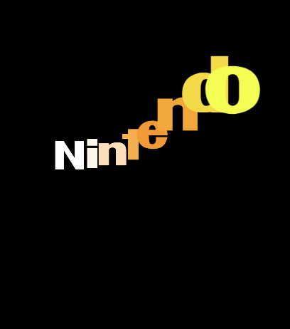
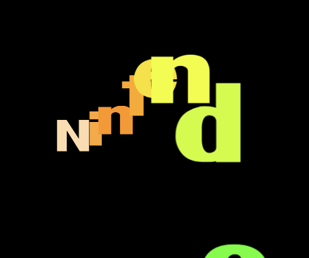
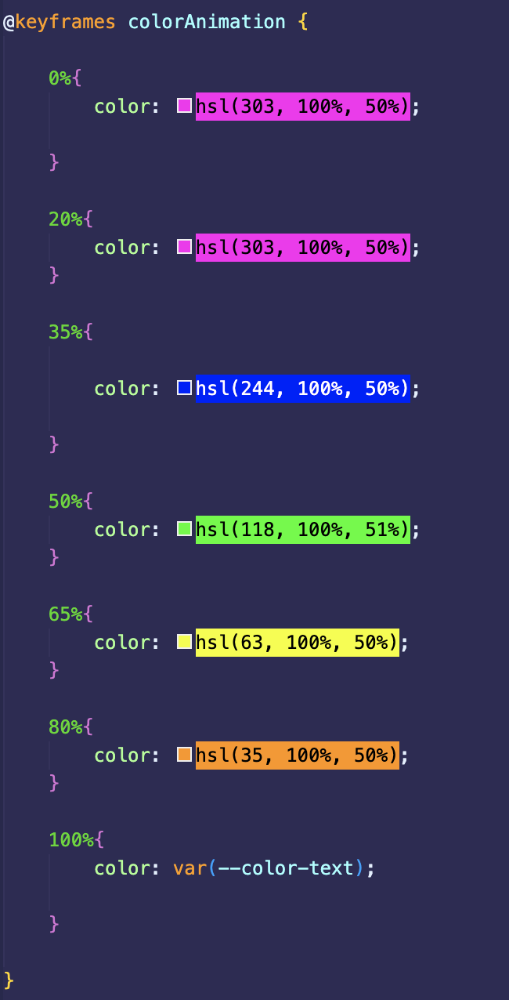
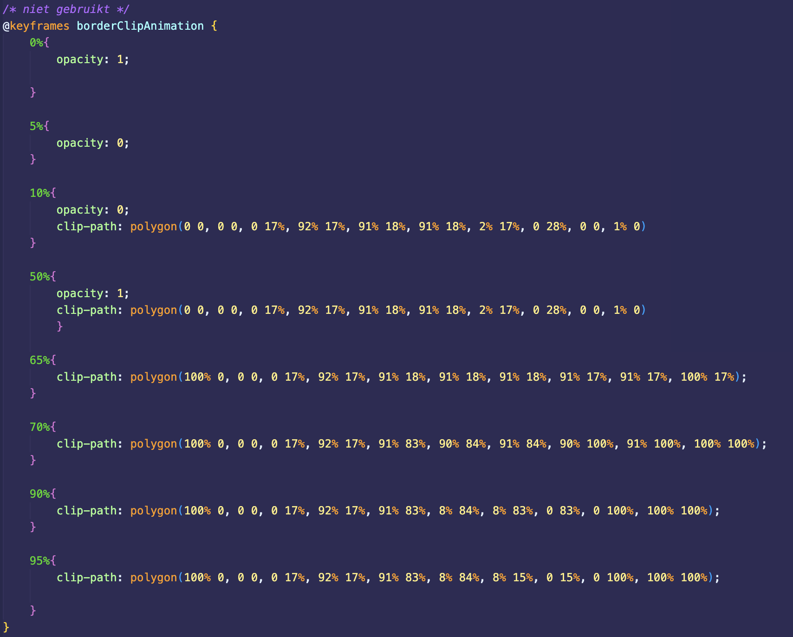
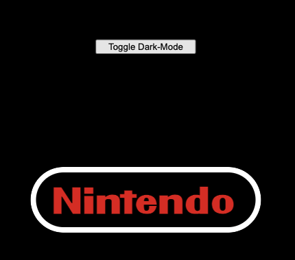

# Procesverslag
**Auteur:** Niels Aling

**De opdrachten:** [opdracht 1](opdracht1/index.html) en [opdracht 2](opdracht2/index.html)

## Bronnenlijst
  1. https://www.youtube.com/watch?v=AyP1Nj9zU3k
  2. https://matthewlein.com/tools/ceaser
  3. https://codepen.io/shooft/pen/PodNyKx
  4. https://hslpicker.com/#10f
  5. https://www.fontsquirrel.com/tools/webfont-generator
  6. https://bennettfeely.com/clippy/

## Opdracht 1 plan

  
uitwerken na schetsen idee (voor week 2)

  ### Je storyboard:
  

  ### Je ambitie: 
  Aan deze technieken/punten wil ik werken:
  - HSL kleuren 
  - positioning
  - :before en/of :after
  - border animation met mask
 

## Opdracht 1 reflectie

  
uitwerken bij afronden opdracht (voor week 4)

  ### Je uitkomst - karakteristiek screenshot(s):
  #### Light Mode 
  
  
  

  #### Dark Mode
  
  
  

  ### Dit ging goed/Heb ik geleerd: 
  De color animation ging heel gemakkelijk. Daarnaast het werken met before en after was redelijk nieuw voor me maar ging me best wel goed af!

  

  ### Dit was lastig/Is niet gelukt:
  In eerste instantie wilde ik de border animeren met een clipmask. Dat is wel gelukt maar was super lastig. Sanne heeft me daarna geholpen met een conic-gradient mask. Die werkte veel netter.

  

  Ook probeerde ik een toggle button te maken voor de dark/light mode, maar ik kreeg in javascript het :before element niet te pakken. Dat is me dus helaas (nog) niet gelukt.
  
  

## Opdracht 2 plan

  
uitwerken na schetsen idee (voor week 5)

  ### Je ontwerp:
  

  ### Je ambitie: 
  Aan deze technieken/punten wil ik werken:
  - punt 1
  - punt 2
  - nog een punt
  - ...

## Opdracht 2 test

  
uitwerken na testen (week 7)

  Neem minimaal 5 bevindingen op:

  ### Bevinding 1:
  Omschrijving van wat er nog niet orde was (tekst en afbeeding(en)).

  #### oplossing:
  Beschrijving hoe je het hebt hebt opgelost of als het niet gelukt is hoe je het zou oplossen (tekst en afbeeding(en)).

  ### Bevinding 2:
  Omschrijving van wat er nog niet orde was (tekst en afbeeding(en)).

  #### oplossing:
  Beschrijving hoe je het hebt hebt opgelost of als het niet gelukt is hoe je het zou oplossen (tekst en afbeeding(en)).

  ### Bevinding 3:
  ...

## Opdracht 2 reflectie

  
uitwerken bij afronden opdracht (voor week 8)

  ### Je uitkomst - karakteristiek screenshot(s):
  

  ### Dit ging goed/Heb ik geleerd: 
  Korte omschrijving met plaatje(s)

  

  ### Dit was lastig/Is niet gelukt:
  Korte omschrijving met plaatje(s)

  

